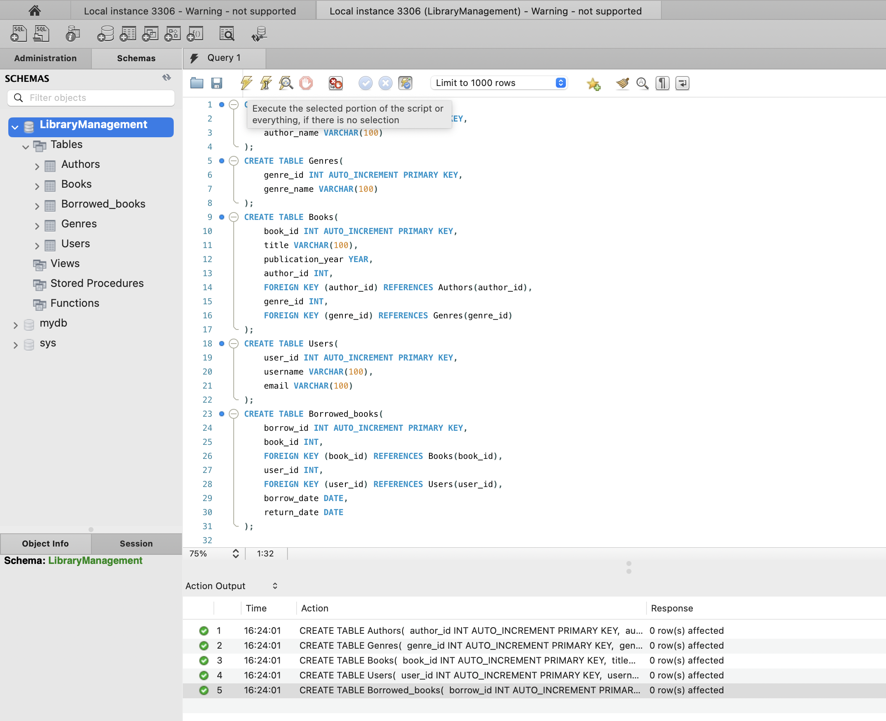
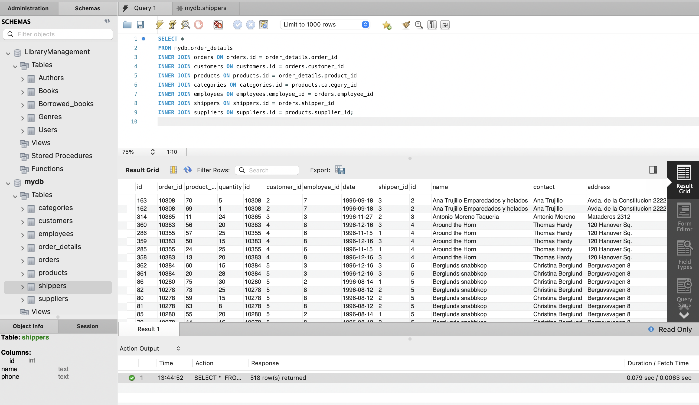
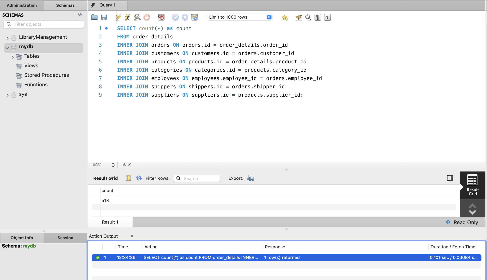
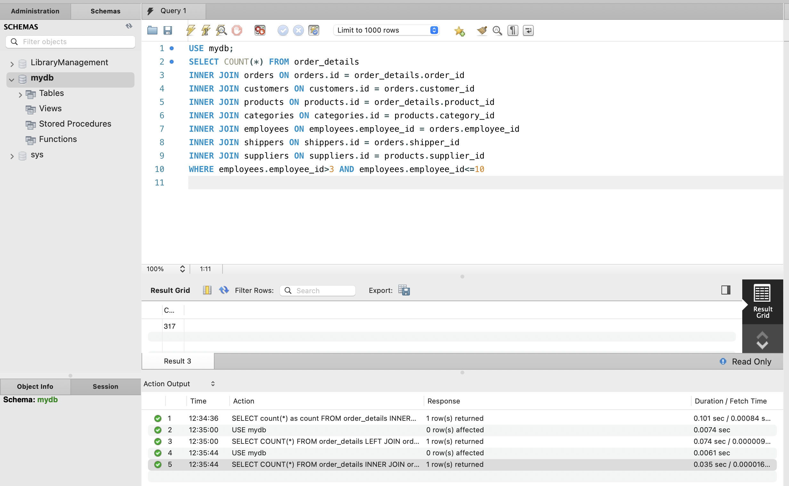
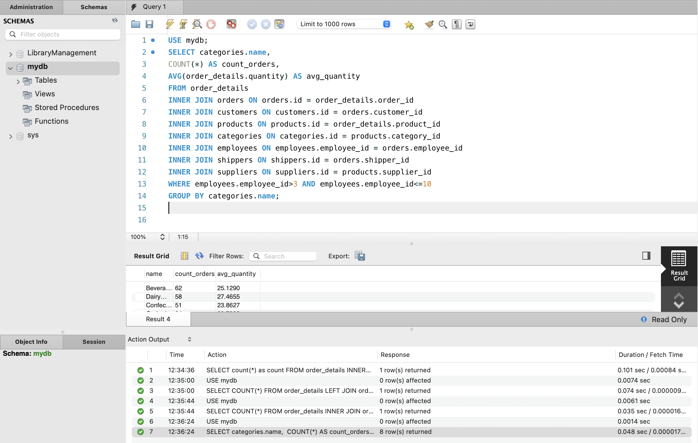
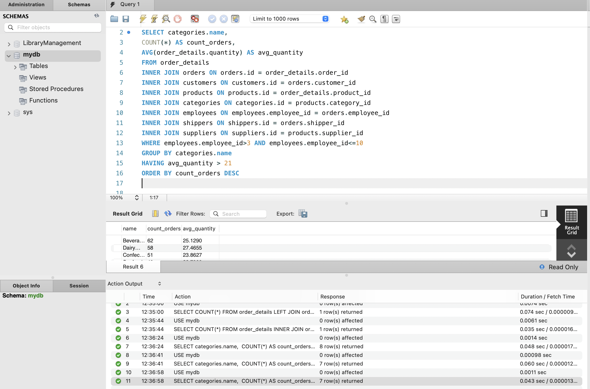
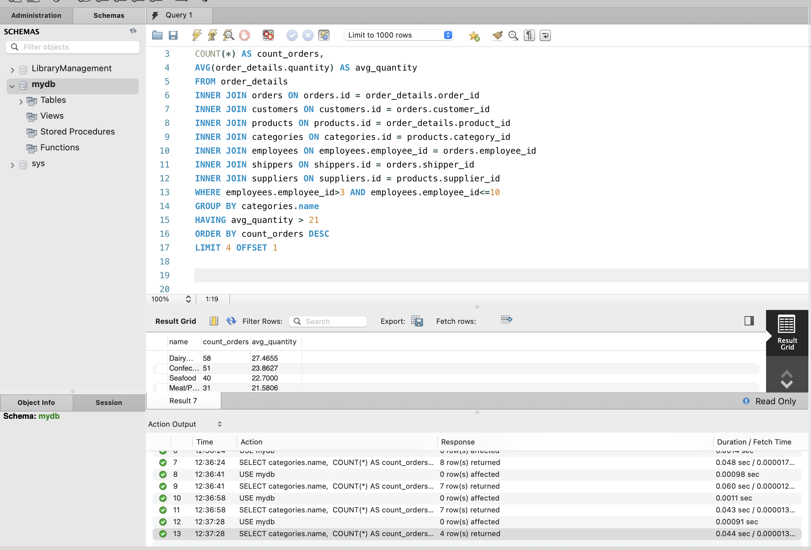

# Домашнє завдання до Теми 4. DML та DDL команди. Складні SQL вирази

## 1. Створіть базу даних для керування бібліотекою книг згідно зі структурою, наведеною нижче. Використовуйте DDL-команди для створення необхідних таблиць та їх зв'язків.



#### a) Назва схеми — “LibraryManagement”
```js
CREATE SCHEMA LibraryManagement;
```
#### b) Таблиця "authors":
- author_id (INT, автоматично зростаючий PRIMARY KEY)
- author_name (VARCHAR)

```js
CREATE TABLE Authors(
	author_id INT AUTO_INCREMENT PRIMARY KEY,
	author_name VARCHAR(100)
);
```
#### c) Таблиця "genres":
- genre_id (INT, автоматично зростаючий PRIMARY KEY)
- genre_name (VARCHAR)
```js
CREATE TABLE Genres(
	genre_id INT AUTO_INCREMENT PRIMARY KEY,
	genre_name VARCHAR(100)
);
```
#### d) Таблиця "books":
- book_id (INT, автоматично зростаючий PRIMARY KEY)
- title (VARCHAR)
- publication_year (YEAR)
- author_id (INT, FOREIGN KEY зв'язок з "Authors")
- genre_id (INT, FOREIGN KEY зв'язок з "Genres")
```js
CREATE TABLE Books(
	book_id INT AUTO_INCREMENT PRIMARY KEY,
	title VARCHAR(100),
  publication_year YEAR,
  author_id INT,
	FOREIGN KEY (author_id) REFERENCES Authors(author_id),
  genre_id INT,
	FOREIGN KEY (genre_id) REFERENCES Genres(genre_id)
);
```
#### e) Таблиця "users":
- user_id (INT, автоматично зростаючий PRIMARY KEY)
- username (VARCHAR)
- email (VARCHAR)
```js
CREATE TABLE Users(
	user_id INT AUTO_INCREMENT PRIMARY KEY,
	username VARCHAR(100),
  email VARCHAR(100)
);
```
#### f) Таблиця "borrowed_books":
- borrow_id (INT, автоматично зростаючий PRIMARY KEY)
- book_id (INT, FOREIGN KEY зв'язок з "Books")
- user_id (INT, FOREIGN KEY зв'язок з "Users")
- borrow_date (DATE)
- return_date (DATE)
```js
CREATE TABLE Borrowed_books(
	borrow_id INT AUTO_INCREMENT PRIMARY KEY,
	book_id INT,
	FOREIGN KEY (book_id) REFERENCES Books(book_id),
	user_id INT,
  FOREIGN KEY (user_id) REFERENCES Users(user_id),
  borrow_date DATE,
	return_date DATE
);
```
## 2. Заповніть таблиці простими видуманими тестовими даними. Достатньо одного-двох рядків у кожну таблицю.

```js
-- Insert random authors
INSERT INTO Authors (author_name)
VALUES ('John Smith'), ('Emily Johnson'), ('Michael Brown');

-- Insert random genres
INSERT INTO Genres (genre_name)
VALUES ('Mystery'), ('Romance'), ('Science Fiction');

-- Insert random books
INSERT INTO Books (title, publication_year, author_id, genre_id)
VALUES ('The Mystery of the Lost Key', 2010, 1, 1),
       ('Love in Paris', 2018, 2, 2),
       ('The Galactic Odyssey', 2022, 3, 3);

-- Insert random users
INSERT INTO Users (username, email)
VALUES ('user123', 'user123@example.com'),
       ('booklover22', 'booklover22@gmail.com'),
       ('readingfanatic', 'readingfanatic@email.com');

-- Insert random borrowed books
INSERT INTO Borrowed_books (book_id, user_id, borrow_date, return_date)
VALUES (1, 1, '2024-03-15', '2024-04-15'),
       (2, 2, '2024-03-20', '2024-04-20'),
       (3, 3, '2024-03-25', '2024-04-25');

```

## 3. Перейдіть до бази даних, з якою працювали у темі 3. Напишіть запит за допомогою операторів FROM та INNER JOIN, що об’єднує всі таблиці даних, які ми завантажили з файлів: order_details, orders, customers, products, categories, employees, shippers, suppliers. Для цього ви маєте знайти спільні ключі. Перевірте правильність виконання запиту.
```js
SELECT * 
FROM mydb.order_details
INNER JOIN orders ON orders.id = order_details.order_id
INNER JOIN customers ON customers.id = orders.customer_id
INNER JOIN products ON products.id = order_details.product_id
INNER JOIN categories ON categories.id = products.category_id
INNER JOIN employees ON employees.employee_id = orders.employee_id
INNER JOIN shippers ON shippers.id = orders.shipper_id
INNER JOIN suppliers ON suppliers.id = products.supplier_id;
```


## 4. Виконайте запити, перелічені нижче.

- Визначте, скільки рядків ви отримали (за допомогою оператора COUNT).
```js
SELECT count(*) as count
FROM order_details
INNER JOIN orders ON orders.id = order_details.order_id 
INNER JOIN customers ON customers.id = orders.customer_id
INNER JOIN products ON products.id = order_details.product_id
INNER JOIN categories ON categories.id = products.category_id 
INNER JOIN employees ON employees.employee_id = orders.employee_id
INNER JOIN shippers ON shippers.id = orders.shipper_id
INNER JOIN suppliers ON suppliers.id = products.supplier_id;
```


- Змініть декілька операторів INNER на LEFT чи RIGHT.
```js
USE mydb;
SELECT COUNT(*) FROM order_details
LEFT JOIN orders ON  orders.id = order_details.order_id
INNER JOIN products ON  products.id = order_details.product_id
INNER JOIN categories ON  categories.id = products.category_id
INNER JOIN customers ON customers.id = orders.customer_id
RIGHT JOIN employees ON employees.employee_id = orders.employee_id
INNER JOIN shippers ON shippers.id = orders.shipper_id
INNER JOIN suppliers ON suppliers.id = products.supplier_id;
```
> Визначте, що відбувається з кількістю рядків. Чому? 
```text
Операція LEFT JOIN, також відома як LEFT OUTER JOIN, у мові SQL використовується для об'єднання рядків із двох таблиць за певною умовою та включення всіх рядків з лівої таблиці, навіть якщо вони не мають відповідності в правій таблиці. Якщо немає відповідності в правій таблиці, виводяться значення NULL.

RIGHT JOIN аналогічний LEFT JOIN: результатом буде таблиця, яка містить усі стовпці з правої таблиці, у нашому випадку це таблиця age. Якщо немає відповідності в names, то виводяться значення NULL.

В нащому випадку кількість рядків не змінилась, що означає що дані не повторюються (інакше б кількість рядків зменшилась).
Також всі рядки мають відповідність з правої таблиці (інакше б кількість рядків збільшилась)
```
- Оберіть тільки ті рядки, де employee_id > 3 та ≤ 10.
```js
USE mydb;
SELECT COUNT(*) FROM order_details
INNER JOIN orders ON orders.id = order_details.order_id 
INNER JOIN customers ON customers.id = orders.customer_id
INNER JOIN products ON products.id = order_details.product_id
INNER JOIN categories ON categories.id = products.category_id 
INNER JOIN employees ON employees.employee_id = orders.employee_id
INNER JOIN shippers ON shippers.id = orders.shipper_id
INNER JOIN suppliers ON suppliers.id = products.supplier_id
WHERE employees.employee_id>3 AND employees.employee_id<=10
```


- Згрупуйте за іменем категорії, порахуйте кількість рядків у групі, середню кількість товару (кількість товару знаходиться в order_details.quantity)
```js
SELECT categories.name, 
COUNT(*) AS count_orders, 
AVG(order_details.quantity) AS avg_quantity
FROM order_details
INNER JOIN orders ON orders.id = order_details.order_id 
INNER JOIN customers ON customers.id = orders.customer_id
INNER JOIN products ON products.id = order_details.product_id
INNER JOIN categories ON categories.id = products.category_id 
INNER JOIN employees ON employees.employee_id = orders.employee_id
INNER JOIN shippers ON shippers.id = orders.shipper_id
INNER JOIN suppliers ON suppliers.id = products.supplier_id
WHERE employees.employee_id>3 AND employees.employee_id<=10
GROUP BY categories.name;
```


- Відфільтруйте рядки, де середня кількість товару більша за 21.
```js
USE mydb;
SELECT categories.name, 
COUNT(*) AS count_orders, 
AVG(order_details.quantity) AS avg_quantity
FROM order_details
INNER JOIN orders ON orders.id = order_details.order_id 
INNER JOIN customers ON customers.id = orders.customer_id
INNER JOIN products ON products.id = order_details.product_id
INNER JOIN categories ON categories.id = products.category_id 
INNER JOIN employees ON employees.employee_id = orders.employee_id
INNER JOIN shippers ON shippers.id = orders.shipper_id
INNER JOIN suppliers ON suppliers.id = products.supplier_id
WHERE employees.employee_id>3 AND employees.employee_id<=10
GROUP BY categories.name
HAVING avg_quantity > 21
```


- Відсортуйте рядки за спаданням кількості рядків.
```js
USE mydb;
SELECT categories.name, 
COUNT(*) AS count_orders, 
AVG(order_details.quantity) AS avg_quantity
FROM order_details
INNER JOIN orders ON orders.id = order_details.order_id 
INNER JOIN customers ON customers.id = orders.customer_id
INNER JOIN products ON products.id = order_details.product_id
INNER JOIN categories ON categories.id = products.category_id 
INNER JOIN employees ON employees.employee_id = orders.employee_id
INNER JOIN shippers ON shippers.id = orders.shipper_id
INNER JOIN suppliers ON suppliers.id = products.supplier_id
WHERE employees.employee_id>3 AND employees.employee_id<=10
GROUP BY categories.name
HAVING avg_quantity > 21
ORDER BY count_orders DESC
```


- Виведіть на екран (оберіть) чотири рядки з пропущеним першим рядком.
```js
SELECT categories.name, 
COUNT(*) AS count_orders, 
AVG(order_details.quantity) AS avg_quantity
FROM order_details
INNER JOIN orders ON orders.id = order_details.order_id 
INNER JOIN customers ON customers.id = orders.customer_id
INNER JOIN products ON products.id = order_details.product_id
INNER JOIN categories ON categories.id = products.category_id 
INNER JOIN employees ON employees.employee_id = orders.employee_id
INNER JOIN shippers ON shippers.id = orders.shipper_id
INNER JOIN suppliers ON suppliers.id = products.supplier_id
WHERE employees.employee_id>3 AND employees.employee_id<=10
GROUP BY categories.name
HAVING avg_quantity > 21
ORDER BY count_orders DESC
LIMIT 4 OFFSET 1
```
